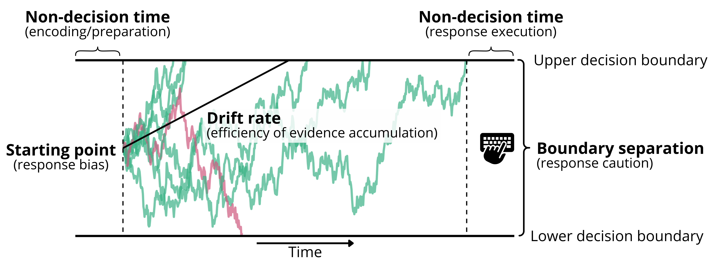

```{r include = FALSE}
library(flextable)
library(officer)

# Load results

load("../3_output/Results/exclusions.RData")
load("../3_output/Results/1_SEM/SEM_fit.RData")
load("../3_output/Results/3_plots/tables_figures.RData")
load("../3_output/Results/4_staging/intext_stats.RData")


knitr::opts_chunk$set(
  echo = F,
  fig.align = "center",
  fig.pos = "!t", 
  out.extra = "",
  fig.show = "asis",
  message = FALSE,
  tab.topcaption = T,
  warning = FALSE
)

# set up flextable for tables
set_flextable_defaults(
  font.family = "Times New Roman", 
  font.size = 12,
  font.color = "black",
  line_spacing = 1,
  padding.bottom = 1, 
  padding.top = 1,
  padding.left = 1,
  padding.right = 1,
  opts_word = list(split = FALSE, keep_with_next = TRUE)
)
```

#### **Unpacking differential item functioning in executive functioning performance using computational modeling**

<br>

#### Stefan Vermeent^1^ (ORCID: 0000-0002-9595-5373)
#### Meriah L. DeJoseph^2,3^ (ORCID: 0000-0002-5086-147X) 
#### Dana Miller-Cotto^4^ (ORCID: 0000-0003-0577-4868)

#### ^1^ Evolutionary and Population Biology, Institute for Biodiversity and Ecosystem Dynamics, University of Amsterdam, Amsterdam, the Netherlands

#### ^2^ Graduate School of Education, Stanford University, United States

#### ^3^ Department of Psychology, University of Denver, United States

#### ^4^ Berkeley School of Education, University of California, Berkeley, United States

<br>

# Corresponding author
Correspondence concerning this article should be addressed to
Stefan Vermeent, Department of Evolutionary and Population Biology, Institute for Biodiversity and Ecosystem Dynamics, University of Amsterdam, Science Park 904, 1098 XH Amsterdam, The Netherlands. E-mail: p.c.s.vermeent@uva.nl.



# Abstract

Measurement non-invariance---or differential item functioning (DIF)---in executive functioning tasks results in biased conclusions about the abilities of people from marginalized groups.
Even if such bias is established, it often remains unclear *why* it occurs.
Here, we use computational modeling---specifically, the Drift Diffusion Model---to investigate which cognitive processes are associated with DIF in executive functioning tasks relating to demographic factors (age, education, and urbanicity) and adversity exposure (childhood threat and deprivation).
We analyze data of `r  prettyNum(as.numeric(exclusions$sample$final_n), big.mark = ",")` Dutch adults from the Longitudinal Internet Studies for the Social Sciences (LISS) panel, who completed five executive functioning tasks, and provided information on their demographics and exposure to childhood adversity.
Using Moderated Non-Linear Factor Analysis, we compare a model based on mean response times with a model based on computational modeling parameters (efficiency of evidence accumulation, response caution, and non-decision time).
We also qualitatively compare associations between moderators and cognitive outcomes across DIF-adjusted and non-adjusted models.
We found several instances of intercept DIF in mean response times as well as all computational modeling parameters---mostly as a function of age, education, and childhood deprivation.
In many cases, DIF in mean response times did not overlap with DIF in computational modeling parameters.
In cases where they did overlap, DIF in mean response times most often corresponded to DIF in response caution, and to a lesser extent to DIF in evidence accumulation and non-decision time.
These result show the value of using computational modeling to gain a process-level understanding of DIF in cognitive tasks.

**Keywords:** executive functioning; Drift Diffusion Model; measurement invariance; moderated nonlinear factor analysis; differential item functioning; adversity

# Statements and Declarations
This research was conducted in part using ODISSEI, the Open Data Infrastructure for Social Science and Economic Innovations (<https://ror.org/03m8v6t10>). 

MLD was supported by the NICHD National Research Service Award (#1F32HD112065-03).

The authors have no relevant financial or non-financial interests to disclose.

SV served as lead for conceptualization, formal analysis, investigation, methodology, and writing - original draft.
MD served in a supporting role for conceptualization, methodology, formal analysis, and writing - review & editing.
DMC served in a supporting role for conceptualization, methodology, and writing - review & editing.

The study was approved by the Ethics committee for research in the Sciences and Life Sciences of the University of Amsterdam (FNWI-41_2023).

Informed consent was obtained from all individual participants included in the study.

All scripts and materials needed to reproduce the findings are available on the article's GitHub page [https://github.com/stefanvermeent/DDM_DIF](https://github.com/stefanvermeent/DDM_DIF).
We make use of data from the LISS panel (Longitudinal Internet studies for the Social Sciences) managed by the non-profit research institute Centerdata (Tilburg University, the Netherlands). 
All datasets are available free of charge in the LISS data archive ([https://www.dataarchive.lissdata.nl/study-units/view/1](https://www.dataarchive.lissdata.nl/study-units/view/1)) after signing a data use agreement ([https://statements.centerdata.nl](https://statements.centerdata.nl)).




#### **Unpacking differential item functioning in executive functioning performance using computational modeling**

The ability to manage goal-directed behavior, or executive functioning, predicts many real-world outcomes, including better health [@gray_burrows_2019], better academic outcomes [@best_2011; @lawson_2017; @titz_2014], and fewer internalizing and externalizing problems [@freichel_2024].
It is therefore important that tasks designed to assess executive functioning provide fair and consistent measurement across groups and time---broadly termed *measurement invariance* [@meredith_1993].
However, many common executive functioning tasks suffer from well-documented issues with reliability [@hedge_2018; @rouder_2019] and validity [@karr_2018].
One contributing factor is that raw performance measures are not task-pure: a single response time reflects multiple cognitive processes, such as response caution and perceptual encoding and motor speed, many of which are not unique to executive functioning [@vermeent_2026; @white_2022].
As a result, two individuals with the same executive functioning ability can obtain different performance scores. 
When construct-irrelevant processes systematically vary across demographic groups or life experiences, they can lead to measurement *non*-invariance or bias, even when the underlying executive functioning ability is similar. 
This form is measurement non-invariance is commonly referred to as differential item functioning (DIF) [@bauer_2023]. 

There is growing awareness that common executive functioning tasks may underestimate the executive functioning abilities of people from low socioeconomic or marginalized groups [@doebel_2020; @miller_cotto_2022; @niebaum_2023; @nketia_2021].
In young children, sociodemographic variables such as race/ethnicity, age, family socioeconomic status, and gender are associated with DIF in executive functioning task performance [@dejoseph_2026; @miller_cotto_2026; @sulik_2010]. 
Similar patterns of DIF have been observed in adults. 
For example, one study found DIF related to age in a cognitive battery including executive functioning tasks among younger and older adults [@hatahet_2024]. 
Another study reported evidence of DIF relating to age, education, and sex, both in a specific executive functioning factor as well as a general factor [@kiselica_2020]. 

Similarly, individuals who have been exposed to adverse experiences---such as poverty or threat---may show lower performance for reasons that are unrelated to their underlying executive functioning ability.
Developmental adaptation theories pose that executive functioning abilities can be calibrated to environmental challenges [@ellis_2017; @frankenhuis_2020].
From this perspective, executive functioning abilities may be expressed more strongly in tasks that better match the contexts in which the abilities were developed.
Consistent with this view, performance of youth with more exposure to threat and deprivation improves when using real-world, contextually relevant content rather than abstract stimuli on some, but not all executive functioning tasks, while such effects are generally not observed for youth with less exposure to adversity [@paone_2025; @young_2022]. 
Similarly, youth from lower socioeconomic backgrounds---which is associated with, but not identical to experiencing material deprivation---score lower on math items involving money, food, and social relationships, independent of their math ability [@duquennois_2022; @muskens_2024]. 
Together, these findings suggest that adversity exposure may shape how executive functioning abilities are expressed under specific task conditions.
However, patterns are generally inconsistent, varying across tasks, content domains, and populations, and current theories cannot account for these differences.

## Understanding the cognitive processes associated with DIF: the Drift Diffusion Model 

Demonstrating DIF in executive functioning tasks indicates that task performance does not operate equivalently across groups, but it does not explain *why* this non-invariance occurs. 
DIF can arise when group characteristics influence how strongly performance indicators relate to a latent construct (loading DIF) or when group characteristics directly influence task performance independent of the latent construct [intercept DIF\; @rohrer_2025]. 
Put simply, loading DIF means that a task is more strongly related to the underlying construct for some participants than for others, whereas intercept DIF means that two people with the same estimated level of the latent construct can nonetheless be expected to perform differently on a particular task.
Both forms of DIF may reflect differences in underlying cognitive processes that contribute to observed performance. 
For example, age-related differences in executive functioning performance are not solely explained by changes in executive functioning ability itself. 
Older adults process information more efficiently on more difficult tasks compared to easier ones, while showing larger decrements on perceptual and memory tasks relative to lexical decision tasks [@theisen_2021]. 
Additionally, motor speed decreases with age [@krause_2020], and older individuals tend to adopt more cautious response strategies in an attempt to minimize errors, more than is mathematically optimal [@starns_2010]. 
These differences influence response times and accuracy independently of executive functioning ability, illustrating how construct-irrelevant processes can produce measurement non-invariance. 
Identifying the specific cognitive processes contributing to DIF can therefore help clarify why task performance differs across groups and inform approaches improving measurement. 

Here, we use computational modeling to examine which underlying cognitive processes contribute to DIF in executive functioning tasks in an adult sample.
Specifically, we use the Drift Diffusion Model (DDM) [@forstmann_2016; @ratcliff_2008], a formal model of binary decision making that has been successfully applied to executive functioning tasks in various previous studies [e.g., @loffler_2024; @vermeent_2024a; @weigard_2021].
The DDM (Figure 1) assumes that people make decisions by accumulating evidence in favor of two response options until they have enough evidence to favor one over the other. 
The accumulated evidence drifts towards one of two decision boundaries, corresponding to each option. 
Once evidence crosses a boundary, the associated decision is executed (e.g., by pressing a button on a keyboard). 
The DDM estimates four key parameters, each mapping onto a distinct cognitive process.
First, the *drift rate* parameter measures the average rate of evidence accumulation toward the correct response option, with higher drift rate resulting in faster and more accurate responses.
Second, the *boundary separation* parameter reflects the width between the two decision boundaries, and measures an individual's response caution.
Larger boundary separation reflects higher response caution, with slower but more accurate responses.
Third, the *non-decision time* parameter measures extra-decisional processes, such as speed of perceptual encoding and motor execution.
Longer non-decision time results in slower responses without a change in accuracy (all else being equal).
Fourth, the starting point measures response bias towards one of two responses.
In line with previous research on executive functioning, we do not consider starting-point differences in this study [e.g., @loffler_2024; @vermeent_2024a].

```{r}
#| label: Figure1
#| fig-width: 6.5
#| fig-height: 7
#| dpi: 600
#| out-width: 6in
#| fig-cap: | 
#|   **Figure 1.** Overview of the Drift Diffusion Model (DDM). Trial-by-trial evidence accumulation is depicted by the green (correct response) and red (incorrect response) lines. The average rate of evidence accumulation (i.e., the drift rate) is depicted by the increasing black line. The black, horizontal lines depict decision boundaries, with their width representing boundary separation. This Figure was adopted with permission from Vermeent et al. (2026).
#|   

```

<br>

Some recent work identifies drift rate as a candidate measure of executive functioning [@weigard_2026a; but see @loffler_2024].
Drift rate indexes the efficiency of task-relevant information processing relative to processing of task-irrelevant information [@weigard_2026a], which closely aligns with traditional conceptualizations of executive functioning [@weigard_2026b].
It also tends to be more stable over time than raw performance measures [@schubert_2016; @tomlinson_2025; @weigard_2021].
Finally, drift rate shows good criterion validity, correlating with self-reported self-control, attentional problems, and externalizing behaviors [@zhang_2026].
Conceptualizing executive  functioning in terms of drift rate has a major advantage when assessing DIF: any DIF in raw performance that corresponds to processes other than executive functioning, is explicitly isolated in other model parameters.
Thus, drift rate may provide a less biased estimate of executive functioning compared to raw performance measures.

## Current study

The goal of the current study was to characterize DIF in mean response times and DDM parameters derived from common executive functioning tasks in a sample of Dutch adults.
Because DDM decomposes performance into separable cognitive processes, comparing DIF in traditional performance scores and DDM-derived parameters allows us to examine whether measurement non-invariance reflects differences in executive functioning-related processing or differences in ancillary processes such as response caution or motor speed.
We used moderated nonlinear factor analysis [MNLFA\; @bauer_2017; @curran_2014], a technique that allows testing and adjusting for DIF resulting from both categorical and continuous moderators.
We focused on three demographic factors (age, education, and urbanicity) and two adversity indicators (exposure to childhood threat and deprivation).
Adversity is a relatively underexplored factor in measurement invariance research.
However, there is growing evidence that performance on some cognitive tasks is particularly sensitive to task content in youth from adversity [@duquennois_2022; @muskens_2024; @young_2022], and that socioeconomic factors lead to qualitative differences in brain structure and function when engaging on executive functioning tasks [@hu_2026]. 

We formulated three research questions. 
First, to what extent do demographic factors and childhood adversity predict DIF in raw performance measures of executive functioning?
Second, to what extent do demographic factors and childhood adversity predict DIF in cognitive processes specific to executive functioning (i.e., drift rate) versus ability-irrelevant processes (i.e., boundary separation or non-decision time), as derived from DDM? 
Third, how do mean-level group differences in executive functioning scores change when comparing unadjusted to DIF-adjusted latent factors?
We had four preregistered predictions.
First, we expected that DIF would be more prevalent and severe in measures of raw performance than in computational model parameters, reflecting greater susceptibility of traditional composites to construct-irrelevant influences tied to demographic background and adversity exposure.
Second, when DIF emerged in computational model parameters, we expected it would occur primarily in boundary separation and non-decision time, reflecting differences in response caution and non-decision processes (e.g., preparation and response execution speed), with relatively less DIF emerging in drift rates (reflecting evidence accumulation).
Third, we expected that adjusting for DIF would attenuate observed group differences in latent executive functioning factor means, indicating that some disparities reflect measurement non-invariance rather than true ability differences.
Fourth, we expected all demographic factors to be associated with at least some DIF in both factor loadings and item intercepts. 
Our investigation of childhood adversity was more exploratory due to a lack of studies investigating DIF related to adversity exposure.

# Methods

## Participants

Participants were recruited through the Longitudinal Internet Studies for the Social Sciences (LISS) panel [@scherpenzeel_2011].
The LISS panel is a representative sample of the Dutch population (invitation-only), with a total of approximately 7,500 individuals spread across around 5,000 households.
Panel members complete a yearly battery of questionnaires about various topics, including health, personality, and their economic situation. 
Additionally, they can participate in a variety of monthly studies that are fielded by external researchers. 
The data in this study were collected across two (identical) data collections, the first one conducted in May 2024, and the second one conducted in July 2025.
Participants had to be between 18 and 60 years old to participate.
We applied a rolling inclusion scheme in which the study was first made available to panel members with lower perceived socioeconomic status and lower completed education before opening it up to the broader panel, to obtain sufficient representation of individuals from lower socioeconomic backgrounds.
For this study, we combined participants that participated in the first study and participants who participated in the second study without participating in the first study (*N* = `r prettyNum(as.numeric(exclusions$sample$initial_n), big.mark = ",")`).
We excluded participants who skipped one or more tasks (e.g., due to technical issues).
Some participants were from the same household; in those cases, we randomly sampled one household member to maintain independent datapoints.
The final sample consisted of `r  prettyNum(as.numeric(exclusions$sample$final_n), big.mark = ",")` participants.

## Cognitive measures

See section 1 of the supplemental materials for more information on mean performance, condition effects, and split-half reliabilities, which were deemed acceptable for all tasks.

### Erikson Flanker task. 

Participants were presented with five horizontal arrows [@eriksen_1974]. 
Their task was to indicate the direction of the central arrow ("A" for left, "L" for right) while ignoring the direction of the flanking arrows.
On half of the trials (congruent condition), all arrows pointed in the same direction.
On the other half (incongruent condition), the flanking arrows pointed in the opposite direction.
Arrows were displayed 300 pixels above or below the center of the screen, which randomly varied between trials.
Participants started with eight practice trials, before completing a total of 64 test trials, divided in two blocks.
Both correct and incorrect trials were stored for DDM estimation.
Mean response times were computed after discarding incorrect trials, separately for the congruent and incongruent condition.

### Simon task.

Participants were presented with the world "LEFT" or "RIGHT" (translated to Dutch), either on the left or right side of the screen [@simon_1963].
Their task was to press the "A" key if the word was "LEFT", and the "L" key if the word was "RIGHT", regardless of the location on the screen.
On half of the trials (congruent condition), the word matched the location (e.g., the word "RIGHT" on the right side of the screen).
On the other half (incongruent condition), the word did not match the location (e.g., the word "RIGHT" presented on the left side of the screen).
Participants started with eight practice trials, before completing a total of 64 test trials, divided in two blocks.
Both correct and incorrect trials were stored for DDM estimation.
Mean response times were computed after discarding incorrect trials, separately for the congruent and incongruent condition.

### Color-shape task.

On each trial, participants were presented with a square or a circle, which could be blue or yellow [@miyake_2000].
Their task was to classify the stimulus based on either shape or color, depending on the current task rule printed at the top of the screen.
On half of the trials (repeat trials), the current rule was the same as on the previous trial (e.g., shape - shape).
On the other half (switch trials), the current rule was different from the previous trial (e.g., shape - color).
Participants never saw the same stimulus more than twice in a row, and there could be at most three repeat or switch trials in a row.
Participants started with eight practice trials, before completing a total of 64 test trials, divided in two blocks.
Both correct and incorrect trials were stored for DDM estimation.
Mean response times were computed after discarding incorrect trials and trials following an incorrect response, separately for the repeat and switch condition.

### Animacy-size task.

On each trial, participants were presented with a single noun (in Dutch) referring to either an animal or an inanimate object [adopted from @braem_2017].
Their task was to classify the stimulus based on whether it referred to a living or non-living thing (e.g., "mouse" versus "mug"), or whether it referred to something that is smaller or larger than a soccer ball (e.g., "pen" versus "whale"), depending on the task rule printed at the top of the screen.
On half of the trials (repeat trials), the current rule was the same as on the previous trial (e.g., size - size).
On the other half (switch trials), the current rule was different from the previous trial (e.g., size - animacy).
Participants never saw the same stimulus more than twice in a row, and there could be at most three repeat or switch trials in a row.
Participants started with eight practice trials, before completing a total of 64 test trials, divided in two blocks.
Both correct and incorrect trials were stored for DDM estimation.
Mean response times were computed after discarding incorrect trials and trials following an incorrect response, separately for the repeat and switch condition.

### Global-local task.

On each trial, participants were presented with either a large square or rectangle, composed of 16 smaller squares or rectangles [adopted from @huizinga_2010].
Their task was to classify the stimulus based on the global shape or the local shapes, depending on whether the stimulus was flanked by a drawing of an elephant (global) or a mouse (local).
These drawings appeared 1,000 ms prior to the stimulus onset.
On half of the trials (repeat trials), the current rule was the same as on the previous trial (e.g., global - global).
On the other half (switch trials), the current rule was different from the previous trial (e.g., local - global).
Participants never saw the same stimulus more than twice in a row, and there could be at most three repeat or switch trials in a row.
Participants started with eight practice trials, before completing a total of 64 test trials, divided in two blocks.
Both correct and incorrect trials were stored for DDM estimation.
Mean response times were computed after discarding incorrect trials and trials following an incorrect response, separately for the repeat and switch condition.

## Moderators

We investigated potential DIF as a function of five moderators, of which three were demographic factors and two were types of childhood adversity exposure.
Demographic variables were (1) age, (2) highest obtained education, and (3) urbanicity, which were all available in monthly updated LISS data.
Age was measured in years (centered).
Highest obtained education consisted of six categories matching the Dutch education system: (1) primary education, (2) prevocational secondary education, (3) senior years of senior general secondary education/pre-university secondary education, (4) secondary vocational education,  (5) higher vocational education, (6) university degree. We treated education as a continuous variable (centered).
Urbanicity was computed by LISS based on the government-recorded population density per km^2^ for the home address provided by participants, divided in five categories: (1) Extremely urban (2,500 or more); (2) very urban (1,500 to 2,500); (3) moderately urban (1,000 to 1,500); (4) slightly urban (500 to 1,000); and (5) not urban (less than 500). 
We recoded urbanicity so that higher values corresponded to a higher urban character, and treated it as a continuous variable (centered).

Childhood adversity measures were (1) exposure to childhood threat, and (2) exposure to childhood deprivation.
Childhood threat was measured using the Neighborhood Violence Scale [@frankenhuis_2018; @frankenhuis_2020], consisting of seven items measuring perceived exposure to neighborhood violence prior to age 18 (e.g., "Crime was common in the neighborhood where I grew up"), rated on a scale of 1 ("Completely disagree") to 7 ("Completely agree").
Childhood deprivation was measured using the Perceived scarcity scale [@young_2022], consisting of four items measuring perceived exposure to material deprivation prior to age 18 (e.g., "My family had enough money to afford the kind of food we all needed ), rated on a scale of 1 ("completely disagree") to 7 ("completely agree").
For both measured, we computed an unweighted average across items.

MNLFA does not handle missing values in moderators.
There were a few missing data patterns (< 1% in all moderators), which we imputed using predictive mean matching [@buuren_2011].
Bivariate correlations of all five moderators are presented in Table 1.

```{r}
table1 |> 
  flextable::flextable() |> 
  flextable::set_header_labels(Variable = "") |> 
  flextable::border_remove() |> 
  flextable::border(i = 1, border.bottom = fp_border_default(), part = "header") |> 
  flextable::border(i = 5, border.bottom = fp_border_default(), part = "body") |> 
  flextable::border(i = 11, border.bottom = fp_border_default(), part = "body") |> 
  flextable::add_header_row(
    values = " ",
    colwidths = 6
  ) |> 
  flextable::compose(
    i = 1, j = 1, 
    as_paragraph(as_b("Table 1. "), "Bivariate correlations between the demographic and adversity measures."),
    part = "header"
  ) |> 
  flextable::add_footer_row(
    values = " ",
    colwidths = 6
  ) |> 
  flextable::autofit()
```

<br>

## Procedure

The procedure was identical for both studies. 
The study was posted at the start of the month together with other LISS studies, and participants could freely choose if and when to participate.
Participation was only possible on a laptop or desktop PC (i.e., mobile phones or tablets were not allowed).
First, participants completed the cognitive tasks in randomized order (the cognitive task battery also contained a basic processing speed task, which is not considered here). 
After each task, participants reported their current state anxiety [using the shortened version of the State-Trait Anxiety Inventory\; @marteau_1992; @bij_2003] and the level of environmental noise (rated on a scale of 1 ('very little noise') to 5 ('a lot of noise')).
On average, the tasks took around 25 minutes to complete. 
Next, participants completed a battery of questionnaires, including the childhood adversity questionnaires.
If participants already completed the childhood measures in a previous study, they were not asked again.
Finally, all participants completed a set of standard LISS evaluation questions on how they experienced the study, allowing them to provide written feedback.
The questionnaires took about 10 minutes to complete.

## Analysis plan

### Transparency and openness

The analyses were preregistered at <https://osf.io/p9em2>.
We deviated from the preregistered plan in two ways, which we explain below.
Analysis code, materials, and instructions for reproduction can be found at <https://github.com/stefanvermeent/DDM_DIF>.

### Data cleaning

For all cognitive tasks, we first applied preregistered trial-level exclusions, followed by participant-level exclusions.
First, we removed response times > 10 s (between `r exclusions$simon$very_slow` and `r exclusions$animacysize$very_slow` for all tasks).
We then removed response times < 250 ms (between `r exclusions$simon$fast` and `r exclusions$animacysize$fast`) and more than 3.2 SD above the intra-individual log-transformed mean response time (between `r exclusions$globallocal$slow` and `r exclusions$simon$slow`).
Second, we removed task data if performance was at chance level, with the cut-off computed based on the 97.5% tail of the binomial distribution one would obtain if purely guessing (between `r exclusions$colorshape$chance` and `r exclusions$globallocal$chance`).
We also removed task data for participants who had fewer than 20 remaining trials following trial-level exclusions.

Both DDM parameter estimates (see 'DDM estimation' section) and mean response time measures were corrected for environmental noise and state anxiety by residualizing them out of the scores.

### DDM estimation

The DDM was fit to each task separately using hierarchical Bayesian estimation with Markov Chain Monte Carlo sampling, which uses group-level information to inform and constrain individual estimates [@vandekerckhove_2011; @wiecki_2013].
Drift rate, boundary separation, and non-decision time were freely estimated for each condition.
The starting-point was fixed to 0.5 (i.e., the mid-point between decision boundaries), assuming no bias.
We used uniform uninformative priors.
The first 2000 samples of each model were discarded as burn-in, after which we retained a total of 30,000 samples across three chains.
We discarded every 10th sample to reduce autocorrelation, resulting in a total of 3,000 samples.
All models converged normally, and model fit was good for each task (see section 2 of the supplementary materials).

### Factor structures

We followed conventional cut-offs for goodness-of-fit in all latent models, focusing on the comparative fit index (CFI) and rood mean square error of approximation (RMSEA) [@hu_1999].
Specifically, CFI values ≥.90 (≥.95), and RMSEA values ≤.08 (≤.06) were interpreted as acceptable (good) model fit.

As expected, all three DDM parameters were best explained by individual, parameter-specific factors that loaded on estimates across all tasks (drift rate: CFI = `r SEM_fit$v$cfi`, RMSEA = `r SEM_fit$v$rmsea`, 95% CI = [`r SEM_fit$v$rmsea.ci.lower`, `r SEM_fit$v$rmsea.ci.upper`]; boundary separation: CFI = `r SEM_fit$a$cfi`, RMSEA = `r SEM_fit$a$rmsea`, 95% CI = [`r SEM_fit$a$rmsea.ci.lower`, `r SEM_fit$a$rmsea.ci.upper`]; non-decision time: CFI = `r SEM_fit$t$cfi`, RMSEA = `r SEM_fit$t$rmsea`, 95% CI = [`r SEM_fit$t$rmsea.ci.lower`, `r SEM_fit$t$rmsea.ci.upper`]).
Contrary to our expectations, response time difference scores were barely correlated with each other, and did not adhere to preregistered factor structures (a unity model in which all tasks loaded on a common executive functioning factor, and a diversity model in which inhibition and attention-shifting measures loaded on separate factors).
An exploratory model in which condition-specific mean response times all loaded on a common response speed factor provided the best fit (CFI = `r SEM_fit$rt$cfi`, RMSEA = `r SEM_fit$rt$rmsea`, 95% CI = [`r SEM_fit$rt$rmsea.ci.lower`, `r SEM_fit$rt$rmsea.ci.upper`]).
We selected this model for all follow-up analyses.

Prior to the MNLFA analyses, we tested whether the factor structures were the same at different levels of each moderator (i.e., configural invariance), which is a prerequisite for further DIF analyses.
For education and urbanicity, we assessed configural invariance at each categorical level.
For age, we created a group of participants < 45 years and a group > 45 years, based on work showing that executive functioning performance starts to decline around that age [@ferguson_2021].
for childhood threat and deprivation, we performed a median split.
We established configural invariance for all moderators across all models, except for two cases: the response time model yielded suboptimal model fit in terms of RMSEA (but not CFI) when considering different levels of age (RMSEA = `r MI_config$config_age_rt_fitstats$rmsea`) and education (RMSEA = `r MI_config$config_edu_rt_fitstats$rmsea`).
As these values are just above the cut-off and given our key goal of comparing DIF across DDM and response time models, we decided to proceed with this model.

### MNLFA analyses

MNLFA analyses were conducted using the OpenMx package [@boker_2011], adopting code from [@kolbe_2024]. 
Testing for DIF proceeded in four steps (see below). 
For DDM parameters, intermediate steps were applied to separate unidimensional models (one per DDM parameter) to reduce model complexity [@gottfredson_2019]. 
In the final model (step 4), we combined all three DDM parameters in a single model.
All model comparisons were done using likelihood ratio tests.

**Step 1. Assess full measurement invariance.** To start, we conducted an omnibus test for full measurement invariance, comparing a fully unconstrained model (i.e., freely estimating all DIF paths) to a constrained scalar model (i.e., fixing all DIF paths to zero). Mean impact of moderators on latent factors was freely estimated in these, as well as all subsequent models.
This constituted a minor deviation from the preregistration, in which we followed @kolbe_2024 by not adding mean impact paths to the fully unconstrained model.
This step was not necessary in our case as we did not estimate DIF in residual variances, which means that the fully unconstrained model was identified when including mean impact paths.
Excluding mean impact path also led to estimation issues.
A statistically significantly worse fit of the scalar model relative to the unconstrained model (at $\alpha$ = .05) was taken as evidence for DIF.

**Step 2. Select anchor variables.** For each model, we selected two anchor indicators to serve as (relatively) DIF-free reference points to ensure the stability of the measurement model. We fit a series of *all-but-one* models, in which only the DIF paths (intercept and loading) of a single indicator were freely estimated, while constraining all others to zero. We compared each all-but-one model to the scalar model. For each latent factor, we selected the two indicators with the lowest DIF (in terms of their $X^2$ test statistic), following recommendations to reserve around 20% of indicators as anchors [@woods_2009].

**Step 3. Assess partial invariance.** After selecting anchor indicators, we assessed partial invariance for each individual DIF path. First, we fit an *anchors-only*  model, in which only the DIF paths involving the anchor indicators were fixed to zero, freely estimating all other DIF paths. Then, we fit a series of *anchors-plus-one* models that iteratively constrained the effect of a single moderator (e.g., age) on a single model parameter (i.e., intercept or loading), in addition to the anchor indicators. We then compared the fit of each *anchors-plus-one* model to the anchors-only model. Here, we used a liberal threshold of $\alpha$ = .10 to retain significant DIF paths in the final model.

**Step 4. Estimate final DIF models.** We estimated a final response time and DDM model that only included the DIF paths that were retained in step 3. For the response time model, the factor structure was identical to step 3. For DDM parameters, the final model combined all three parameters in a single model, with a separate latent factor per parameter.
Latent factors were allowed to covary, as were DDM parameters from the same task.
By combining all three parameters, the model accounted for typical covariances between parameters. 
We applied a Benjamini-Hochberg correction to *p*-values in the final models, and only considered DIF paths with an adjusted *p*-value < .05.

**Mean impact.** After estimating the final models, we compared the magnitude and direction of associations between each moderator and latent factor in the final DIF-adjusted model and a full scalar model, in which all DIF paths were constrained to zero.
We made these comparisons on a descriptive, qualitative level, consistent with previous work [e.g., @dejoseph_2021; @dejoseph_2026; @magro_2024].
This was a deviation from the preregistration, in which we planned to test for differences in associations in a way that we later realized was statistically inaccurate.

# Results

## Loading DIF

We found several (generally small) sources of loading DIF for both mean response times and DDM parameters, mostly related to education and exposure to childhood threat (Figure 2). 
However, in not a single case was loading DIF in mean response times mirrored in DDM parameters.

Education was associated with lower response time loadings on the congruent and incongruent condition of the Flanker task ($\beta$ = `r DIF_load_rt_stats$edu_rt_fl_con$Estimate`, *p* `r DIF_load_rt_stats$edu_rt_fl_con$pvalue_adj`; $\beta$ = `r DIF_load_rt_stats$edu_rt_fl_inc$Estimate`, *p* `r DIF_load_rt_stats$edu_rt_fl_inc$pvalue_adj`, respectively), suggesting that more highly educated participants relied less on general response speed on these tasks.
In contrast, education was associated with a lower drift rate and non-decision time loading for the Color-shape repeat condition ($\beta$ = `r DIF_load_ddm_stats$edu_v_cs_rep$Estimate`, *p* `r DIF_load_ddm_stats$edu_v_cs_rep$pvalue_adj`; $\beta$ = `r DIF_load_ddm_stats$edu_t_cs_rep$Estimate`, *p* `r DIF_load_ddm_stats$edu_t_cs_rep$pvalue_adj`), and a smaller non-decision time loading on the Color-shape switch condition ($\beta$ = `r DIF_load_ddm_stats$edu_t_cs_sw$Estimate`, *p* `r DIF_load_ddm_stats$edu_t_cs_sw$pvalue_adj`).
Age and urbanicity were only associated with a few small sources of DIF. 

Childhood threat was associated with larger response time loadings on both conditions of the Global-local task (repeat: $\beta$ = `r DIF_load_rt_stats$thr_rt_gl_rep$Estimate`, *p* `r DIF_load_rt_stats$thr_rt_gl_rep$pvalue_adj`; switch: $\beta$ = `r DIF_load_rt_stats$thr_rt_gl_sw$Estimate`, *p* `r DIF_load_rt_stats$thr_rt_gl_sw$pvalue_adj`), suggesting that participants with more exposure to threat relied more on general response speed on these tasks.
Deprivation was only associated with two small DIF patterns, one for non-decision time on the Simon congruent condition ($\beta$ = `r DIF_load_ddm_stats$dep_t_si_con$Estimate`, *p* `r DIF_load_ddm_stats$dep_t_si_con$pvalue_adj`) and one for drift rate on the Animacy-size repeat condition ($\beta$ = `r DIF_load_ddm_stats$dep_v_as_rep$Estimate`, *p* `r DIF_load_ddm_stats$dep_v_as_rep$pvalue_adj`).

```{r}
#| label: Figure2
#| fig-width: 10
#| fig-height: 11
#| dpi: 600
#| fig-cap: | 
#|   **Figure 2.** Standardized estimates of differential item functioning (DIF) in factor loadings as a function of demographic and adversity moderators. Each box corresponds to a specific task x moderator combination. Within each box, the top row presents DIF in the mean response time, and the bottom row presents DIF in each DDM parameter (drift rate, boundary separation, non-decision time, respectively) of the same task. Estimates printed in gray did not reach statistical significance in the final model. Cells denoted with † were constrained to zero in the final model because they did not reach statistical significance in the intermediate model.<br>
#|   \* *p* < .05; \*\* *p* < .01; \*\*\* *p* < .001.
plot_loading_DIF
```
<br>

## Intercept DIF

Intercept DIF was much more common than loading DIF in both mean response times and DDM parameters.
Within demographic factors, intercept DIF was spread roughly equally across mean response times and DDM parameters, which was not consistent with our hypothesis. 
In contrast to loading DIF, intercept DIF related to demographic variables was in most cases linked to intercept DIF in DDM parameters. 
In those cases, most were associated with response caution (seven in total), and fewer with evidence accumulation and non-decision time (three each). 
For instance, more highly educated individuals tended to be faster than expected on attention control tasks; this pattern co-occurred with lower-than-expected response caution (between $\beta$ = `r DIF_int_ddm_stats$edu_a_fl_con$Estimate` and $\beta$ = `r DIF_int_ddm_stats$edu_a_fl_inc$Estimate`), even though their evidence accumulation tended to be lower than expected (between $\beta$ = `r DIF_int_ddm_stats$edu_a_si_inc$Estimate` and $\beta$ = `r DIF_int_ddm_stats$edu_a_fl_inc$Estimate`). 
In contrast, more highly educated individuals were slower than expected on the Color-shape switch condition ($\beta$ = `r DIF_int_rt_stats$edu_cs_sw$Estimate`, *p* `r DIF_int_rt_stats$edu_cs_sw$pvalue_adj`) and Animacy-size repeat condition ($\beta$ = `r DIF_int_rt_stats$edu_as_rep$Estimate`, *p* `r DIF_int_rt_stats$edu_as_rep$pvalue_adj`).
This was related to a combination of higher-than-expected response caution (between $\beta$ = `r DIF_int_ddm_stats$edu_a_as_rep$Estimate` and $\beta$ = `r DIF_int_ddm_stats$edu_a_as_sw$Estimate`) and slower-than-expected non-decision time (between $\beta$ = `r DIF_int_ddm_stats$edu_t_as_sw$Estimate` and $\beta$ = `r DIF_int_ddm_stats$edu_t_gl_sw$Estimate`) on some, but not all attention-switching tasks. 
Older adults were slower than expected on the Flanker task (congruent: $\beta$ = `r DIF_int_rt_stats$age_fl_con$Estimate`, *p* `r DIF_int_rt_stats$age_fl_con$pvalue_adj`; incongruent: $\beta$ = `r DIF_int_rt_stats$age_fl_inc$Estimate`, *p* `r DIF_int_rt_stats$age_fl_inc$pvalue_adj`).
This was linked to higher response caution (congruent: $\beta$ = `r DIF_int_ddm_stats$age_a_fl_con$Estimate`, *p* `r DIF_int_ddm_stats$age_a_fl_con$pvalue_adj`; incongruent: $\beta$ = `r DIF_int_ddm_stats$age_a_fl_inc$Estimate`, *p* `r DIF_int_ddm_stats$age_a_fl_inc$pvalue_adj`) and slower non-decision time on the incongruent condition ($\beta$ = `r DIF_int_ddm_stats$age_t_fl_inc$Estimate`, *p* `r DIF_int_ddm_stats$age_t_fl_inc$pvalue_adj`), even though their evidence accumulation was more efficient than expected across attention-control tasks (between $\beta$ = `r DIF_int_ddm_stats$age_v_si_con$Estimate` and $\beta$ = `r DIF_int_ddm_stats$age_v_fl_inc$Estimate`). 
Urbanicity was not associated with any intercept DIF. 

In childhood adversity measures, intercept DIF was of smaller magnitude and almost exclusively found in DDM parameters, mostly evidence accumulation and response caution. 
In particular, individuals with more exposure to childhood deprivation showed some patterns of lower-than-expected evidence accumulation on the Flanker congruent condition ($\beta$ = `r DIF_int_ddm_stats$dep_v_fl_con$Estimate`, *p* `r DIF_int_ddm_stats$dep_v_fl_con$pvalue_adj`) and the Flanker incongruent condition ($\beta$ = `r DIF_int_ddm_stats$dep_v_fl_inc$Estimate`, *p* `r DIF_int_ddm_stats$dep_v_fl_inc$pvalue_adj`); higher-than-expected response caution on the Simon congruent condition ($\beta$ = `r DIF_int_ddm_stats$dep_a_si_con$Estimate`, *p* `r DIF_int_ddm_stats$dep_a_si_con$pvalue_adj`); and slower-than-expected non-decision time on the Simon incongruent condition ($\beta$ = `r DIF_int_ddm_stats$dep_t_si_inc$Estimate`, *p* `r DIF_int_ddm_stats$dep_t_si_inc$pvalue_adj`) and the Color-shape repeat condition ($\beta$ = `r DIF_int_ddm_stats$dep_t_cs_rep$Estimate`, *p* `r DIF_int_ddm_stats$dep_t_cs_rep$pvalue_adj`).


```{r}
#| label: Figure3
#| fig-width: 10
#| fig-height: 11
#| dpi: 600
#| fig-cap: | 
#|   **Figure 3.** Standardized estimates of differential item functioning (DIF) in task intercepts as a function of demographic and adversity moderators. Each box corresponds to a specific task x moderator combination. Within each box, the top row presents DIF in the mean response time, and the bottom row presents DIF in each DDM parameter (drift rate, boundary separation, non-decision time, respectively) of the same task. Estimates printed in gray did not reach statistical significance in the final model. Cells denoted with † were constrained to zero in the final model because they did not reach statistical significance in the intermediate model.<br>
#|   \* *p* < .05; \*\* *p* < .01; \*\*\* *p* < .001.
plot_intercept_DIF
```

<br>

## Mean impact

Finally, we compared direction and magnitude of unadjusted associations with DIF-adjusted associations between the moderators and latent factors (Figure 4).
All DIF-adjusted associations were in the same direction as the unadjusted associations, and none led to qualitatively different interpretations.
The association between age and response time was slightly overestimated in the unadjusted model ($\beta$ = `r impact_stats$age_rt_unadjusted$estimate`) relative to the DIF-adjusted model ($\beta$ = `r impact_stats$age_rt_adjusted$estimate`).
Curiously, the pattern was in the opposite direction for DDM parameters: associations between age with drift rate and non-decision time were slightly underestimated in the unadjusted model ($\beta$ = `r impact_stats$age_v_unadjusted$estimate` and `r impact_stats$age_t_unadjusted$estimate`, respectively) relative to the DIF-adjusted model ($\beta$ = `r impact_stats$age_v_adjusted$estimate` and `r impact_stats$age_t_adjusted$estimate`, respectively). 
For simplicity, we only unpack significant DIF-adjusted associations below.

Age was positively associated with mean response times ($\beta$ = `r impact_stats$age_rt_adjusted$estimate`, *p* `r impact_stats$age_rt_adjusted$pvalue_null`), with older participants showing slower responses.
This association was related to all three DDM parameters: age was negatively associated with drift rate ($\beta$ = `r impact_stats$age_v_adjusted$estimate`, *p* `r impact_stats$age_v_adjusted$pvalue_null`), positively associated with boundary separation ($\beta$ = `r impact_stats$age_a_adjusted$estimate`, *p* `r impact_stats$age_a_adjusted$pvalue_null`), and positively associated with non-decision time ($\beta$ = `r impact_stats$age_t_adjusted$estimate`, *p* `r impact_stats$age_t_adjusted$pvalue_null`).
Thus, older participants had less efficient evidence accumulation, were more cautious, and were slower to encode information and/or execute responses.
Education was negatively associated with mean response times ($\beta$ = `r impact_stats$education_rt_adjusted$estimate`, *p* `r impact_stats$education_rt_adjusted$pvalue_null`), with more highly educated participants showing faster responses.
This association co-occurred with a positive association with drift rate ($\beta$ = `r impact_stats$education_v_adjusted$estimate`, *p* `r impact_stats$education_v_adjusted$pvalue_null`), and a negative association with non-decision time ($\beta$ = `r impact_stats$education_t_adjusted$estimate`, *p* `r impact_stats$education_t_adjusted$pvalue_null`), but not by boundary separation.
More highly educated participants had more efficient evidence accumulation, and were faster to encode information and/or execute responses.
We did not find any significant associations for urbanicity.

Childhood deprivation was positively associated with mean response times ($\beta$ = `r impact_stats$deprivation_rt_adjusted$estimate`, *p* `r impact_stats$deprivation_rt_adjusted$pvalue_null`).
Participants with more exposure to childhood deprivation showed slower responses.
This association was related to a negative association between childhood deprivation and drift rate ($\beta$ = `r impact_stats$deprivation_v_adjusted$estimate`, *p* `r impact_stats$deprivation_v_adjusted$pvalue_null`), such that participants with more exposure to childhood deprivation had less efficient evidence accumulation.
Childhood deprivation was not associated with boundary separation or non-decision time.
We did not find a significant association between childhood threat and mean response times ($\beta$ = `r impact_stats$threat_rt_adjusted$estimate`, *p* `r impact_stats$threat_rt_adjusted$pvalue_null`).
However, childhood threat was negatively associated with drift rate ($\beta$ = `r impact_stats$threat_v_adjusted$estimate`, *p* `r impact_stats$threat_v_adjusted$pvalue_null`).
As with deprivation, participants with more exposure to childhood threat had less efficient evidence accumulation.
Childhood threat was not significantly associated with boundary separation or non-decision time.


```{r}
#| label: Figure4
#| fig-width: 8
#| fig-height: 10
#| dpi: 600
#| fig-cap: | 
#|   **Figure 4.** Standardized associations between demographic and adversity moderators with latent factors in unadjusted (scalar) and DIF-adjusted models. The top panel (yellow background) presents mean impacts on mean response times. The bottom three panels (blue background) present mean impacts on DDM parameters (drift rate, boundary separation, and non-decision time, respectively). Error-bars represent 95% confidence intervals. the vertical dashed line represents a null-effect.

plot_impact
```
<br>

# Discussion

We investigated DIF patterns relating to demographic factors (age, education, and urbanicity) and adversity exposure (childhood threat and deprivation) in a battery of five executive functioning tasks.
Using MNLFA, we compared a latent model based on mean response times (i.e., raw performance) with a model based on computational modeling parameters, focusing on DIF in factor loadings and task intercepts.
Specifically, we used the DDM to distinguish between three distinct cognitive processes: (1) efficiency of evidence accumulation (drift rate); (2) response caution (boundary separation); and (3) speed of stimulus encoding and response execution (non-decision time).
We also compared associations between each moderator and cognitive outcomes (i.e., mean impact) across DIF-adjusted and non-adjusted models.
Collectively, this approach allowed us to examine not only whether executive functioning task performance indicators functioned equivalently across groups, but also whether any observed non-equivalence appeared to be concentrated in evidence accumulation related to executive functioning or in ancillary cognitive processes that influence task performance. 

We found few sources of DIF in factor loadings (i.e., group differences in the relationship between the general latent factor and indicators), and those that were observed did not overlap between the mean response time and DDM model.
All five tasks showed at least some loading DIF.
Although most of these effects were small and did not appear to matter for the validity of the general latent factors, they warrant caution when researchers interpret performance on individual tasks.
This applies both to mean response times and DDM parameters; all three DDM parameters were associated with DIF in at least one task.
We found several instances of intercept DIF (i.e., systematic group differences in individual indicators, holding latent factor constant)---mostly related to age, education and childhood deprivation---indicating task-specific differences in how performance indictators functioned across levels of these characteristics.
In cases where DIF in mean response times overlapped with DIF in DDM parameters, it most often corresponded to DIF in response caution, and to a lesser extent with DIF in evidence accumulation and non-decision time.
This pattern indicates that some group differences in response time indicators likely reflect differences in strategic responding (e.g., how strongly individuals prioritize accuracy versus speed) or differences in perceptual and motor processes, rather than differences in information processing related to executive functioning itself. 
However, the same demographic factors and adversity exposures were also associated with DIF in evidence accumulation on several tasks, which were not linked to DIF in mean response times.

Taken together, the results were mostly inconsistent with our prediction that DDM parameters would be less susceptible to DIF.
We did find, partially in line with our prediction, that DIF in DDM parameters tended to be more often associated with response caution, and less often with evidence accumulation and non-decision time.
However, there were some noteworthy cases where we found DIF in the efficiency of evidence accumulation, without corresponding DIF in mean response times.
This is consistent with recent accounts suggesting that evidence accumulation on any given task reflects a combination of general evidence accumulation efficiency (which is conceptually linked to executive functioning), and specific factors, such as task difficulty, content effects, and a person's state [@weigard_2021].
Indeed, drift rate is reliably associated to these task features [@lerche_2020; @wall_2021].
Thus, although we find that latent task-general evidence accumulation estimates are mostly bias-free, researchers should be cautious when equating task-specific evidence accumulation as bias-free estimates of executive functioning ability.
Nonetheless, these findings illustrate the value of computational modeling, which lies in helping researchers localize where in the decision process measurement non-equivalence arises. 

Despite comparable DIF patterns between mean response times and DDM parameters, the latter provide important additional insights.
For instance, faster responses in more highly educated individuals were related to a combination of more efficient evidence accumulation and faster non-decision times.
This pattern suggests that education-related differences in task performance may reflect both more efficient information processing and faster perceptual or motor preparation, rather than purely differences in executive functioning ability. 
Similarly, slower responses in older adults were related to a combination of longer non-decision time and higher response caution, and to a lesser extent by lower efficiency of evidence accumulation.
This is consistent with research that challenges the idea that response slowing in older adults is primarily explained by a decline in processing speed [@salthouse_1996].
Instead, a recent meta-analysis found robust effects for boundary separation and non-decision time in the same direction as the current study, which were independent of task type (perceptual, lexical, and memory) or task difficulty [@theisen_2021].
They also found that older adults showed slower evidence accumulation on perceptual and lexical tasks (but not memory tasks), and that this effect interacted with task difficulty: older adults benefited from more complex tasks, which were tasks with lower average drift rates.
The current DIF findings suggest the opposite effect: we found that older adults had more efficient evidence accumulation than expected on easier tasks.
This difference possibly stems from the fact that all tasks in the current study were more difficult executive functioning tasks, compared to tasks included in @theisen_2021.

For childhood adversity, DDM parameters captured more individual variation than mean response times.
Deprivation was associated with longer mean response times, which was matched with less efficient evidence accumulation.
This is consistent with contemporary dimensional models of adversity, which predict that exposure to deprivation has widespread negative effects on cognitive abilities, whereas exposure to threat is mostly associated with changes in socioemotional processing [@salhi_2021; @sheridan_2020].
However, while we did not find an association between exposure to threat and response times, we did find a negative association with the efficiency of evidence accumulation.
This suggests that threat may be associated with cognitive processes in ways that remain hidden when analyzing raw performance.
Indeed, recent work has similarly found negative associations between exposure to childhood threat and evidence accumulation in youth [@vermeent_2024a] and adults [@vermeent_2024b]. 
Thus, while contemporary models of adversity tend to think of deprivation as the primary driver of executive functioning challenges, threat may similarly be associated with executive functioning-related processes in ways that are missed when analyses are limited to raw performance.
This illustrates how a disaggregation of cognitive processes through DDM can yield more nuanced insights into how different types of adversity exposure shape cognition.

## Strengths and limitations

The current study had three noteworthy strengths.
First, our results were based on large panel data that was based on representative sampling from the Dutch population.
Second, we investigated DIF patterns across demographic factors and measures of childhood adversity exposure.
Compared to demographic factors, exposure to adversity has been relatively overlooked as a potential source of DIF, despite a growing body of research showing that performance in adversity-exposed individuals is more strongly affected by task content [@young_2022; @duquennois_2022; @paone_2025] and context [@mittal_2015; @young_2018].
Third, our use of computational modeling allowed a more fine-grained window into the cognitive processes that may contribute to DIF patterns in common executive functioning tasks.

The study also had a few limitations.
First, our focus on Dutch adults does not readily generalize to other countries and age groups.
For instance, replication studies in countries with larger socioeconomic gaps between urban and rural areas may find stronger evidence of DIF relating to urbanicity.
Our results also cannot provide insights into how educational materials for youth could be made more equitable along demographic and socioeconomic factors.
Second, we were unable to fit a conventional latent model to raw performance measures.
Instead, we settled on estimating a single latent factor loading on both high-demand and low-demand conditions.
This made the latent factor of response time more difficult to interpret as a measure of executive functioning.
We do note, however, that convergence issues of generally accepted factor structures of executive functioning is a known issue [@karr_2018], and may require rethinking how executive functioning is conceptualized and measured [@doebel_2020; @miller_cotto_2022; @weigard_2026b].
Third, raw performance measures and DDM parameters were computed based on different sets of trials, which complicates a direct comparison.
Specifically, we followed conventions for computing mean response times by only considering correct responses and disregarding incorrect responses.
Given that the DDM considers response times for both correct and incorrect responses, its cognitive parameters are informed by a larger part of the data.
This may have explained some of the differences between DIF in mean response times and DDM parameters.

## Future directions

Preventing DIF requires strong theory on *why* executive functioning tasks show DIF.
We find that DIF is related to different cognitive processes, not just relating to how people process information, but also relating to the strategy they use and how quickly they prepare and execute responses.
The present findings therefore suggest that improving measurement equity in executive functioning tasks may require targeting specific cognitive processes rather than applying uniform adjustments across tasks. 
Consistent with this complexity, recent studies find that using real-world stimuli in cognitive tasks is a double-edged sword, either enhancing or lowering performance in ways that are poorly understood [@duquennois_2022; @muskens_2024; @paone_2025; @young_2022].
The tasks in the current study differ in multiple ways, including their difficulty level and the stimuli they use (e.g., arrows, geometric shapes, nouns).
Future research could design experiments that systematically tease apart task features that may explain DIF in specific cognitive processes.
This knowledge could lead to qualitatively different task adaptations. 
For instance, preventing DIF in boundary separation may require giving explicit instructions on the importance of speed versus accuracy, or to allow for more practice to give everyone an equal level of confidence in their performance.
In contrast, preventing DIF in non-decision time may require simplifying response options, or adding goal reminders during trials.
Beyond the goal of lowering non-invariance, such studies have the potential to produce fundamental insight into how individual differences shape cognitive performance.

We focused on a relatively wide set of potential moderators, covering both demographic and socioeconomic factors.
However, other demographic factors (e.g., sex, race) and environmental exposures (e.g., neglect, unpredictability) are potentially associated with DIF in comparable adult samples.
It is also probable that the same moderators have different effects in different countries and non-Western cultures.
Finally, our results do not readily generalize to children and adolescents.
Rather than an endpoint, the current study should be seen as a first and inevitably incomplete investigation into the factors underlying DIF in executive functioning performance and related cognitive processes.
Future research could leverage our computational approach to studying measurement invariance in other age groups, relating to other moderators, and focusing on other executive functioning tasks or cognitive domains.

## Conclusion

We used computational modeling to disaggregate and isolate which cognitive processes are associated with DIF underlying executive functioning task performance.
This approach aligns with recent calls for a more substantive approach to measurement invariance [@fischer_2025; @rohrer_2025].
We show that DIF in executive functioning tasks is associated with multiple cognitive processes, ranging from information processing to how people trade off speed and accuracy.
Identifying these processes not only has the potential to inform the development of bias-free tasks, but can also provide fundamental insight into how people from different backgrounds approach specific cognitive tasks.
Thus, we see great value in computational modeling as a tool to understand DIF on a process level, especially when combined with rigorous experimental designs.



# References

